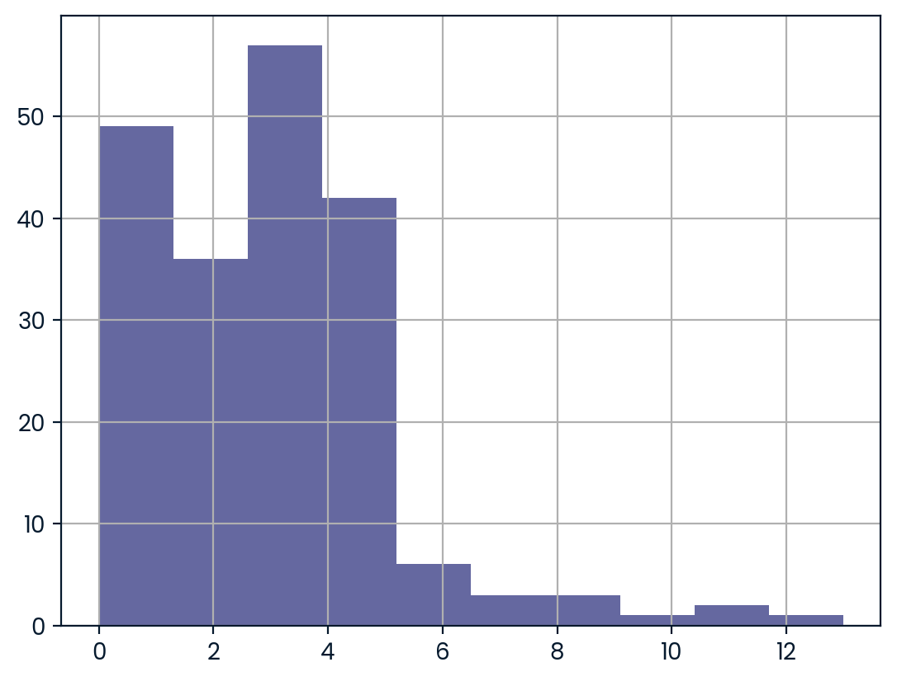

# Análisis Estadístico de Goles en el Fútbol Internacional con Pruebas de Hipótesis

El objetivo de este proyecto es realizar una **prueba de hipótesis no paramétrica** para determinar si en los partidos internacionales de **fútbol femenino** se marcan significativamente más goles por partido que en los de **fútbol masculino** en Copas del Mundo de la FIFA posteriores al 1 de enero de 2002. El análisis busca validar estadísticamente esta premisa para la redacción de un artículo de periodismo deportivo respaldado en datos.

---

### Herramientas y tipo de proyecto

  
  
  
  
  
  
  
  
  
  

---

### Preguntas clave
1. ¿Sigue la variable del total de goles por partido una distribución normal en ambos grupos?
2. ¿Qué prueba de hipótesis es la adecuada para comparar dos distribuciones numéricas independientes no normales?
3. ¿Existe evidencia estadística suficiente para rechazar la hipótesis nula ($H_0$) con un nivel de significancia $\alpha = 0.10$?
4. ¿Se marcan estadísticamente más goles por partido en la Copa Mundial Femenina que en la Masculina?

---

### Metodología
* **Preprocesamiento y filtrado de datos:**
  * Carga y conversión de la columna `date` a formato `datetime` en ambos conjuntos de datos (`men_results.csv` y `women_results.csv`).
  * Filtrado de observaciones para considerar exclusivamente partidos del torneo **'FIFA World Cup'** jugados después del **2002-01-01**.
  * Creación de la variable objetivo `total_score` sumando los goles locales y visitantes (`home_score + away_score`).
* **Evaluación de Normalidad:**
  * Construcción de histogramas de frecuencias para `total_score` en ambos grupos.
  * Confirmación visual de que la distribución de goles está sesgada hacia la derecha y no sigue una distribución normal, descartando el uso de pruebas paramétricas como la $t$ de Student. 
* **Prueba de Hipótesis No Paramétrica:**
  * Ejecución de la prueba **U de Mann-Whitney** unilateral hacia la derecha (`alternative = 'greater'`) para evaluar si la distribución de goles femeninos es mayor que la de masculinos.
  * Planteamiento formal de hipótesis:
    * **$H_0$:** La distribución de goles en partidos de fútbol femenino es igual a la de fútbol masculino.
    * **$H_A$:** La distribución de goles en partidos de fútbol femenino es significativamente mayor que la de fútbol masculino.
  * Evaluación contra un nivel de significancia $\alpha = 0.10$.

---

### Conclusiones y recomendaciones

#### Resultados inferenciales:
* **Valor $p$ calculado:** La prueba U de Mann-Whitney arrojó un **$p\text{-value} = 0.0051$** ($0.0051066$).
* **Decisión Estadística:** Dado que $p\text{-value} \le \alpha$ ($0.0051 \le 0.10$), se procede a **rechazar la hipótesis nula ($H_0$)**.

#### Conclusión práctica y periodística:
* **Respaldo cuantitativo:** Existe evidencia estadísticamente significativa para afirmar que en los partidos de la Copa Mundial Femenina de la FIFA se anotan más goles por partido en promedio/mediana que en los torneos masculinos desde 2002.
* **Rigor científico:** Como el $p\text{-value}$ ($0.0051$) es incluso significativamente inferior a niveles de exigencia más estrictos como el $1\%$ ($\alpha = 0.01$), el hallazgo proporciona un sólido sustento matemático para la publicación del artículo de investigación deportiva.

---

### Visualizaciones destacadas

1. **Distribución de Goles en el Fútbol Masculino:** Histogramas que muestran el sesgo a la derecha y la falta de normalidad en los datos.

  

2. **Distribución de Goles en el Fútbol Femenino:**

  

---

### Diccionario de datos

Los datos históricos corresponden a los archivos `men_results.csv` y `women_results.csv`. Ambos contienen la información oficial de partidos internacionales con las siguientes columnas:

| Columna | Descripción |
| --- | --- |
| `date` | Fecha en la que se disputó el encuentro deportivo (formato `YYYY-MM-DD`). |
| `home_team` | Nombre de la selección o equipo que jugó en condición de local. |
| `away_team` | Nombre de la selección o equipo que jugó en condición de visitante. |
| `home_score` | Número de goles anotados por el equipo local. |
| `away_score` | Número de goles anotados por el equipo visitante. |
| `tournament` | Nombre del torneo o competición (ej. *FIFA World Cup*, *Euro*, *Friendly*, etc.). |
